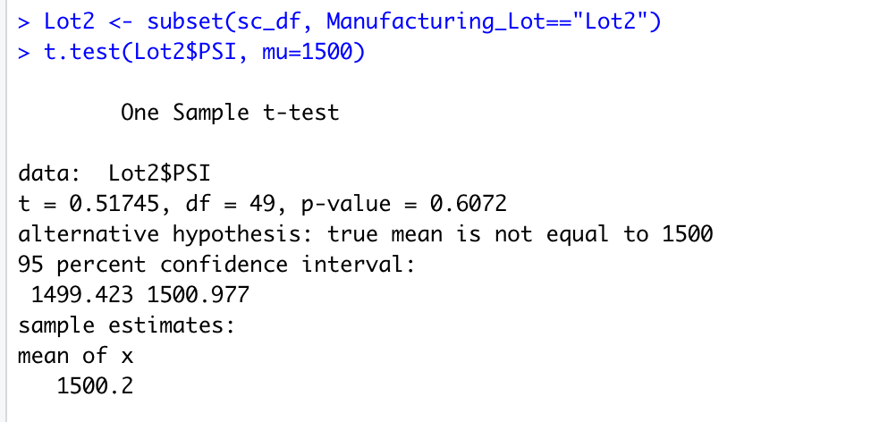

# MechaCar Statistical Analysis with R

## Linear Regression to Predict MPG
The MechaCar_mpg.csv dataset contains mpg test results for 50 prototype MechaCars. The MechaCar prototypes were produced using multiple design specifications to identify ideal vehicle performance. Multiple metrics, such as vehicle length, vehicle weight, spoiler angle, drivetrain, and ground clearance, were collected for each vehicle. 

Used R, to design a linear model that predicts the mpg of MechaCar prototypes using several variables from the MechaCar_mpg.csv file.

Please see below the results of the linear regression model. For information on how this was done please see the [MechaCarChallenge](MechaCarChallenge.R) RScript file. 

### Summary 
Based on the p-values noted above, it appears that the vehicle_length, and ground_clearance are below the 0.05 threshold, and therefore are statistically unlikely to provide random amounts of variance to the mpg values in the data set. 

The intercept also provided a non-random amount of variance to the mpg values, which means a significant amount of variability in the dependent variable (mpg) when all independent vairables are equal to zero. A significant intercept could mean that the significant features (such as vehicle length and ground clearance) may need scaling or transforming to help improve the predictive power of the model. Alternatively, it may mean that there are other variables that can help explain the variability of our dependent variable that have not been included in our model.

The linear regression tests the following hypotheses:

H0 : The slope of the linear model is zero, or m = 0

Ha : The slope of the linear model is not zero, or m ≠ 0

The p-value of the multi-linear regression analysis is 5.35e-11  which is much smaller than our assumed significance level of 0.05%. Therefore, we can state that there is sufficient evidence to reject our null hypothesis, which means that the slope of our linear model is not zero.

The R-squared valye is 0.7149 which means that about 71.49% of the mpg values can be predicted (or attributed to) the variables in the model. It can be assumed that the linear model can predict mpg of MechaCar prototypes effectively.

## Summary Statistics on Suspension Coils
The MechaCar Suspension_Coil.csv dataset contains the results from multiple production lots. In this dataset, the weight capacities of multiple suspension coils were tested to determine if the manufacturing process is consistent across production lots. Used of R, to create a summary statistics table to show:

* The suspension coil’s PSI continuous variable across all manufacturing lots
* The following PSI metrics for each lot: mean, median, variance, and standard deviation.

Please see below the results of the summary statistics data frames. For information on how this was done please see the [MechaCarChallenge](MechaCarChallenge.R) RScript file. 

### Summary 
The total_summary dataframe summarizes the PSI statistics for all Lots (Lot 1, 2, 3). The average weight across all vehicle in the lots was about 1500 pounds. The variance of the vehicles across all lots was 62.3 pounds, which is below the design specification of variance not exceeding 100 pounds per square inch. Therefore all three Lots in total meet the design specification.

The lot_summary dataframe summarizes the PSI statistics for each individual Lot. Both Lot 1 and Lot 2 had average weights of about 1500 (Lot 2 being slightlty larger by 0.2) and Lot 3 having a smaller average weight of about 1496.14. The variance for both Lot 1 and Lot 2 where lower than the design specification of 100 pounds. Lot 1 had a variance of 0.98 pounds and Lot 2 had a variance of 7.47 pounds. Therefore Lot 1 & Lot 2 meet the design specification. 

However, Lot 3 did not meet the design specification, it had a variance of about 170.3 pounts which is way about the 100 pound variance restriction. 

## T-Tests on Suspension Coils
Used R to perform t-tests to determine if all manufacturing lots and each lot individually are statistically different from the population mean of 1,500 pounds per square inch.

Please see below the results of the t-tests. For information on how this was done please see the [MechaCarChallenge](MechaCarChallenge.R) RScript file. 

### Summary
A one-sample t-test is used to test the following hypotheses:

H0  : There is no statistical difference between the observed sample mean and its presumed population mean.

Ha : There is a statistical difference between the observed sample mean and its presumed population mean.

For the first t-test to determine if the PSI across all manufacturing lots is statistically different from the population mean of 1,500 pounds per square inch, the p-value is 0.06 which is above the 0.05 threshold. Therefore we can't reject the null hypothsis, meaning there is no statistical difference between the observed sample mean for all manufacturing lots (mean of 1498.78) and the population mean of 1500. 

For the second t-test, to determine if the PSI for Lot 1 is statistically different from the population mean of 1,500 pounds per square inch, the p-value is 1 which is above the 0.05 threshold. Therefore we can't reject the null hypothsis, meaning there is no statistical difference between the observed sample mean for Lot 1 (mean of 1500) and the population mean of 1500. In fact the p-value is one because the mean for Lot 1 and the population mean are exactly the same! 

For the third t-test, to determine if the PSI for Lot 2 is statistically different from the population mean of 1,500 pounds per square inch, the p-value is 0.6072 which is above the 0.05 threshold. Therefore we can't reject the null hypothsis, meaning there is no statistical difference between the observed sample mean for Lot 1 (mean of 1500.2) and the population mean of 1500. 

For the fourth t-test, to determine if the PSI for Lot 3 is statistically different from the population mean of 1,500 pounds per square inch, the p-value is 0.0.04 which is below the 0.05 threshold. Therefore we can reject the null hypothsis, meaning there is a statistical difference between the observed sample mean for Lot 2 (1496.14) and the population mean of 1500. 

## Study Design: MechaCar vs Competition
Using R, a statistical study can be designed to compare performance of the MechaCar vehicles against performance of vehicles from other manufacturers. 

A few tests can be run which would be of interest to consumers. One suggestion which focus on the costs of different vehicles would ask the question:
Do the average costs differ between the MechaCar model and similar models of competitors 

### Metrics 
The study would require the following metrics:
* Cost for MechaCar model and similar models of competitors 

In particular, we would need the cost for multiple vehicles for each model being tested in order to get the average cost of each model. 

### Hypothesis 
The null and alternative hypothesis would look like the following: 

H0 : The mean costs of all models are equal, or µ1 = µ2 = … = µn.

Ha : At least one of the means costs is different from all other models.

### Statistical Test
Since the question is looking at whether the average costs differ between MechaCar and competitors models, a one-way ANOVA test could be run. 

ANOVA tests look at if there is a statistical difference between the distribution means from multiple samples. Specifically, a one-way ANOVA is used to test the means of a single dependent variable across a single independent variable with multiple groups. (e.g., fuel efficiency of different cars based on vehicle class).
In this case, it would look at if there is a statistical difference between the average cost of all models (MechaCar and the competitors).

### Data Needed 
To run the ANOVA test in R, we would use the `aov()` function which takes in two arguments:
* forumla 
* data 

The formula is a special statement in R that tells the `aov()` function how to interpret the different variables and factors. We would use the formula Y ~ A, where Y is the column name of the dependant variable and A is the column name of the independant variable. 

The data is the name of our input data frame. The data frame would contain columns for each variable. 

In order to run the ANOVA test in R, the following is needed:
* dependent variable: Cost of vehicle 
* independent variable: the model of the car (MechaCar model, vs. competitor car models - which are similar to MechaCar). 

There should be multiple vehicles, and their associated cost for each model type in order to get the average cost of each model type to be compared. The vehicle IDs would be different, but the Model Type should be the same for each group of cars. 

Additionally, the ANOVA test have assumptions about the input data that must be validated prior to using the statistical test:
	1. The dependent variable is numerical and continuous, and the independent variables are categorical.
	2. The dependent variable is considered to be normally distributed.
	3. The variance among each group should be very similar.

Depending on the dataset used, the data may need to be cleaned in order to align with the data types noted in the assumptions.

The `aov()` function would look like this: 

`aov(cost ~ model, data= model_cost_df)`

Where model_cost_df is a hypothetical data set which contains columns for the costs and models of each vehicle in the data set. 

